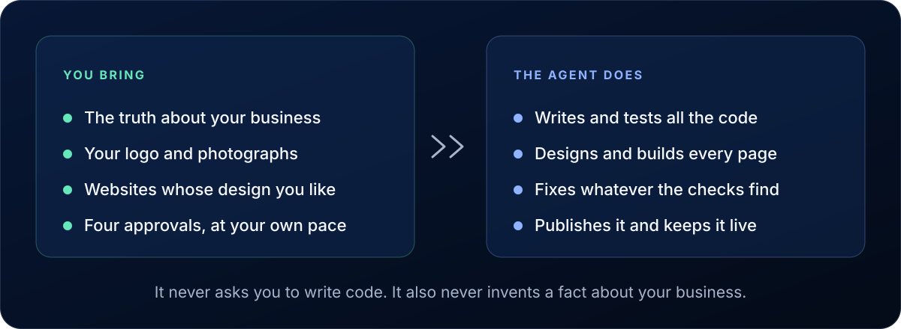
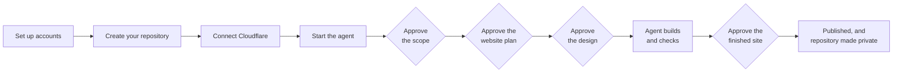
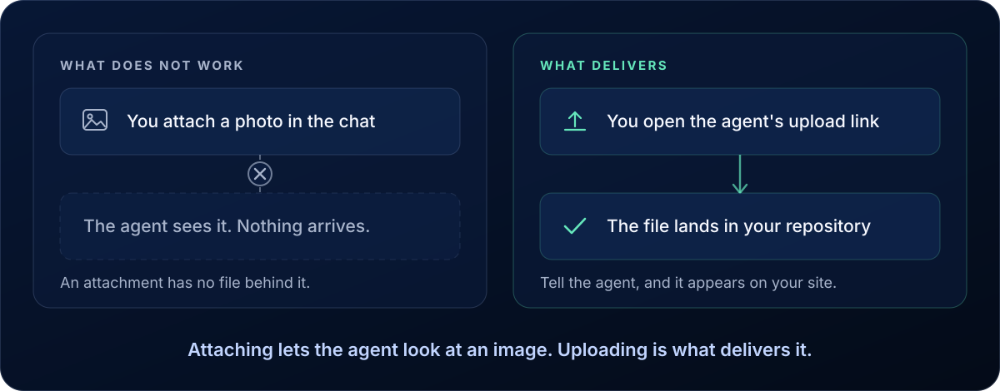
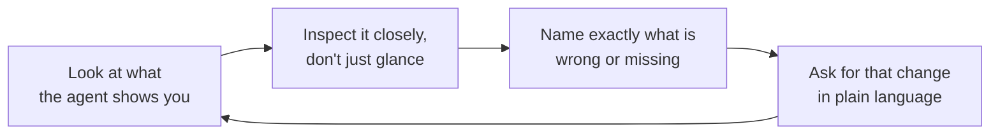
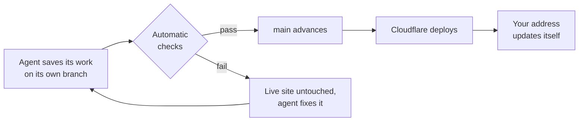

<p align="center">
  
</p>

# IndexDock Starter

The template behind IndexDock's free course *Website from scratch*, which you can also follow at [www.indexdock.com/en-US/school/website-from-scratch](https://www.indexdock.com/en-US/school/website-from-scratch). Questions about the course belong there; this repository's issues are for problems with the template itself.

This repository is a free, guided course and the project you build while taking it. By the end you will have a real website for your business, live on the internet, that you own. It will carry your business name, your services and your contact details, and it will be built to a professional technical standard, without you writing a single line of code.

You work in one long conversation with an AI coding agent. You describe your business, review what the agent produces, and ask for changes until it is right. That loop is not a beginner's imitation of software development. It is how a great many professional developers build software today, so the skill you pick up here outlasts this one website.

**Who it is for:** freelancers, local service businesses and solo professionals. **What it costs:** one paid AI subscription, around US$20 a month, for a month or two. **What it takes:** a web browser and a few hours spread over as many sittings as you like.

## Contents

- [What you'll build, and what you won't](#what-youll-build-and-what-you-wont)
- [Who does what](#who-does-what)
- [The journey](#the-journey)
- [What you need before you start](#what-you-need-before-you-start)
- [The words you'll meet](#the-words-youll-meet)
- [Why your site will be ready for AI search](#why-your-site-will-be-ready-for-ai-search)
- [Part 1 — Set it up](#part-1--set-it-up)
- [Part 2 — Set up your agent](#part-2--set-up-your-agent)
- [Part 3 — Start the build](#part-3--start-the-build)
- [Part 4 — Your logo and photos](#part-4--your-logo-and-photos)
- [Part 5 — Design](#part-5--design)
- [Part 6 — Build and check](#part-6--build-and-check)
- [Part 7 — Asking for changes](#part-7--asking-for-changes)
- [Part 8 — Finish](#part-8--finish)
- [After launch](#after-launch)
- [How work reaches your website](#how-work-reaches-your-website)
- [For maintainers and coding agents](#for-maintainers-and-coding-agents)
- [Licence](#licence)
- [No warranty](#no-warranty)
- [About IndexDock](#about-indexdock)

> [!TIP]
> Read this page all the way to the end before you begin Part 3. None of it asks anything of you until then, and a handful of details, especially the one about uploading images, are far easier to get right the first time than to fix afterwards.

## What you'll build, and what you won't

An informational or lead-generation website. Lead generation just means the site's main job is to get interested visitors to contact you, rather than to sell to them on the spot. Expect one to five pages in a single language, covering what you do, who you help, examples of past work, and simple ways to reach you such as a phone number, an email address or a messenger link.

This is not the right tool for an online store with a checkout, a site where visitors create accounts and log in, a booking system built from scratch, or anything that has to store private customer data. If your idea includes one of those, the agent will propose a simpler version that still works well, or tell you plainly that a different kind of tool is needed. It will not quietly build the wrong thing.

## Who does what

<p align="center">
  
</p>

The agent does every technical thing: writing the code, testing it, fixing what it finds, and publishing. It will never ask you to write code, touch a terminal, or manage a branch.

You are responsible for something different and just as important: the truth about your business. What you do, who your customers are, what makes you different, what you want visitors to do. Think of it as hiring a skilled website builder who has never met you. They can build anything, but only if you tell them clearly what you need.

That division has a hard rule behind it. The agent is not allowed to invent facts about your business. No made-up statistic, no fake customer review, no promise you never made. Every claim on the finished site traces back to something you actually said, which is exactly why your detailed, honest answers are what make the result good.

> [!WARNING]
> Never paste passwords, access tokens or payment details into the chat or into any file in this project, and never share them with the agent. It does not need them at any point.

## The journey



Four approvals, drawn as diamonds above, are the points where nothing moves forward until you say yes.

## What you need before you start

Three accounts. GitHub and Cloudflare are free. The AI subscription is not.

| Account | Cost | What it is for |
| --- | --- | --- |
| GitHub | Free | Stores your website's files |
| Cloudflare | Free | Puts your website on the internet |
| Claude | Paid | The AI coding agent that builds it |

Claude Code needs a paid Claude plan to finish this project. There is no free tier with enough usage, so going straight to a paid plan saves you from stopping halfway. You do not need an expensive one: the entry-level plan, around US$20 a month at the time of writing, is enough to build a complete small-business website here.

That money buys a general-purpose AI subscription, not a one-time pass. It keeps working for everything else afterwards, and it is ready whenever you want to build a second website from this same template.

The steps below are written for Claude Code. Codex Cloud works too if that is the agent you already use; it needs a paid ChatGPT plan, for the same reason.

## The words you'll meet

You do not need to use these words yourself. They are here so nothing in the process feels like a term you were supposed to already know.

| Word | What it means |
| --- | --- |
| **Repository** | A single project folder that lives online, holding all your website's files and the full history of every change. Yours, on GitHub. |
| **Template** | A ready-made starting project you copy into your own new repository with one click. This repository is one. |
| **Hosting** | Keeping your website's files somewhere the whole internet can load them. |
| **Deploying** | Making a new or updated version of your website available to visitors. |
| **Worker** | The part of Cloudflare that actually answers visitors and serves your pages. |
| **Coding agent** | A program you talk to in plain English that can read, write and test code by itself. |
| **Prompt** | Any message you type to the agent. That is all it is: ordinary written instructions. |
| **Domain** | A web address you register for your business, like yourbusiness.com, instead of the free one you start with. |
| **Indexing** | What search engines and AI assistants do when they read a site and add it to their catalogue, so it can turn up in answers later. |

## Why your site will be ready for AI search

What this gives you is **technical readiness**. Your site is built so that computer programs, search engines and AI assistants alike, can open your pages, understand what your business does, and describe it accurately if somebody asks. Three things carry that:

- **Crawlable** means a program can open and read your pages the same way you can. Some sites accidentally hide their content from these programs. This one does not.
- **Structured** means the important facts, your name, your services, your location, are labelled in the underlying code rather than left as loose text or trapped in a picture.
- **Accessible** means the site works for as many visitors and devices as possible, including people using screen readers.

What nobody can honestly promise, and this project does not, is rankings, traffic, or a guarantee that an AI assistant will mention you by name. Those depend on competition, location and timing. Be wary of anyone who says otherwise. What you get is a site with no technical barrier standing in the way.

While you are still building, your site carries a quiet instruction telling search engines and AI assistants not to index it yet, so nobody stumbles onto an unfinished page. That comes off automatically when you give your final approval in Part 8.

## Part 1 — Set it up

Everything here happens in your browser.

**1. Create your accounts.** Sign up at [github.com](https://github.com) and at [cloudflare.com](https://cloudflare.com), confirming your email address for each. Then sign up at [claude.ai](https://claude.ai) and upgrade to a paid plan. Keep your usernames and passwords somewhere safe. Cloudflare does not ask for payment details for what you need here.

**2. Create your repository.** Signed in to GitHub, open [github.com/IndexDock/website-from-scratch](https://github.com/IndexDock/website-from-scratch) and select **Use this template → Create a new repository**. Name it after your business, choose **Private**, and create it. Then leave it completely alone: apart from uploading your logo and photos later, when the agent asks, you never open or edit a file yourself.

**3. Create your Cloudflare Worker.** Signed in to Cloudflare, follow these in order.

1. In the left sidebar, select **Build**.
2. Under Build, select **Compute (Workers & Pages)**.
3. Select **Create application**.
4. Select **Continue with GitHub**.
5. Choose the repository you just created.
6. For the build command, enter `npm run build`.
7. For the deploy command, enter `npx wrangler deploy`.
8. If you are shown a production branch, leave it as `main`. That is the branch your finished website is published from.
9. If you see **Builds for non-production branches**, leave it switched off. It is not needed and it uses up Cloudflare's free build allowance faster.
10. Select **Deploy**.

You do not need to add any variables, and you are never asked to name anything. Cloudflare names the Worker for you, and the agent reconciles that name with the project later. If Cloudflare asks you to set up your account's `workers.dev` subdomain, do it now: it only appears once. The build takes a minute or two.

**4. Turn on your public web address.** This is a separate setting, in a different place, and your site is not reachable until it is on. Go back to **Build → Compute (Workers & Pages)**, open the Worker you just created, select the **Domains** tab, find the entry labelled **production**, and turn it on.

**5. Check that it worked.** On your Worker's page, select **Visit** in the top right. You should see the IndexDock Starter page. This is not your business website yet, just a temporary page confirming everything is wired up correctly. Your real website will appear at this same address as the agent builds it.

If you get an error instead, Cloudflare is probably still finishing the deployment. Wait about a minute and reload.

Take a moment with this. That address now works everywhere: your phone, a tablet, a friend's computer. It is a small milestone and a real one.

<details>
<summary>Two things you will notice, both expected</summary>

Near the bottom of the page there is a small line reading "Built with IndexDock Starter". That is a quiet credit to the free template, and it stays after your real website replaces the starter page. Keeping it is the default, not a condition: ask the agent to remove it if you would rather not have it.

If the template has been useful, this is a fitting moment to star [the repository](https://github.com/IndexDock/website-from-scratch) on GitHub. It is entirely optional and never blocks anything.

</details>

## Part 2 — Set up your agent

**Connect Claude Code to GitHub.** Open [claude.ai/code](https://claude.ai/code) and sign in. If you have not connected GitHub yet, follow the prompt to install the Claude GitHub App. When it asks which repositories it may use, choosing **all repositories** is simplest and avoids your new repository failing to appear.

**Choose a model.** Near the message box there is a menu listing models from most powerful at the top to more modest below. A more powerful model tends to produce better work and uses up your allowance faster. Either end of that list finishes the job.

**Choose a reasoning effort.** Low, medium or high, controlling how much thought the agent puts into each step. Higher gives a more polished result and takes longer. This matters because of the limit below: at a lower effort you are more likely to finish inside one five-hour session, while at a higher one you will almost certainly continue in a later sitting and get a better site for it. There is no wrong answer.

**Know the usage limits.** Claude Code's allowance resets every five hours. If you reach it mid-build the agent simply stops and says so; once the five hours are up, type something like "Continue working" and it resumes exactly where it left off. There is a separate weekly limit as well.

**Turn on Auto mode.** In the more cautious modes the agent asks permission before every single change, which means sitting at your screen approving one small step after another. Auto mode lets it work through many steps on its own. It suits this project: the site is lightweight and asks for nothing sensitive on your computer. Auto mode is not the same as unsupervised, though. Check back when it notifies you, because it still stops at the real decisions only you can make.

## Part 3 — Start the build

Open your repository in Claude Code, with your model and mode chosen, and send exactly this:

```text
Start or continue my IndexDock Starter website. Read the repository state first, tell me where we are, and guide me through the next approved step.
```

> [!IMPORTANT]
> Keep using that same task from beginning to end. If it ever becomes unavailable, open a new one and send the same message again. The agent reads your saved progress and approved documents, tells you where you are, and carries on without making you answer anything twice. Your progress is saved no matter how long the gap.

The agent starts with a couple of quick questions to confirm your idea fits what this template builds, then moves on to the real ones: what you do, who your ideal customers are, what problems you solve, what you offer, what makes you different, what you want visitors to do, and what photos or logos you have.

Answer at length. Resist the urge to keep it short. There is no such thing as too much detail here, and if a fact feels small or obvious, say it anyway. Vague answers produce a generic website; specific ones produce a site that sounds like your business. You are the only source of truth the agent has.

When the questions are done the agent gives you a package: a summary of your business, the list of pages, and what goes on each one. **This is your first real approval.** Read it properly. Nothing moves to design until you say yes, and this is the cheapest possible moment to correct anything wrong or missing.

## Part 4 — Your logo and photos

<p align="center">
  
</p>

> [!IMPORTANT]
> Attaching an image to the chat is **not** the same as delivering it. The agent can look at an attachment and describe it, but it cannot save that file into your website. If you only ever attach images, your finished site will not contain them.

When the agent needs your logo or photos it gives you a direct link that opens GitHub's upload page for your repository. Select it, drag your files in, and confirm with the button GitHub already has selected. You do not need to choose a folder, a path or a branch. Then tell the agent you have uploaded, and it puts each file exactly where it belongs.

No logo yet? That is fine. The agent proposes an honest placeholder, such as your business name in a chosen typeface or its initials as a simple mark, and shows it to you for approval first. You can replace it with a real logo at any point, during this course or years later.

## Part 5 — Design

The agent builds a small number of genuinely different visual directions for your homepage, usually three, or two when your references point strongly one way, each using your real approved content, just presented differently. You see them on a live, working preview rather than as flat pictures, so you can judge them properly.

**Come prepared.** Before this stage, collect screenshots of websites whose design you genuinely like. Any kind of business, not necessarily one like yours. The agent will ask for **eight to fifteen** of them in a single request, and more are welcome. They travel through the same GitHub upload link as your other files.

It helps enormously if you can say what you like about each one. Is it the typeface, the colours, whether corners are sharp or rounded, how much empty space there is, how large the images are? Say the same about anything you dislike. You do not need design vocabulary. Any honest description in your own words beats no preference at all.

When the concepts are ready you can approve one, ask for a revised version of one you almost like, reject them all and ask for a different direction, or mix and match, for example taking one concept as the base with another's colour scheme. Nothing is final until you approve it.

## Part 6 — Build and check

With a design approved, the agent writes the real website section by section, running its own checks as it goes and fixing what they turn up.

A second, more thorough round runs automatically after it saves: whether the site works on phones as well as computers, and whether automated accessibility checks find anything that would get in the way of people using assistive technology. The agent reads those results and fixes what they find. You do not run or watch any of it.

Your live address updates itself as the work lands. Whenever the agent says it is a good time to look, open that address again.

## Part 7 — Asking for changes

You are allowed, and encouraged, to ask for changes at any point. You are not being difficult or ungrateful. Speaking up clearly about what you want is not a side effect of using these tools well; it is the actual skill. The people who get the best results are the ones who look closely and ask for exactly what they want, as many times as it takes.



**Show, don't only tell.** If something looks wrong in a way that is easier to show than describe, take a screenshot and add it to your message with a plain description of what should be different. On Windows press <kbd>Win</kbd> + <kbd>Shift</kbd> + <kbd>S</kbd> and drag over the area. On a Mac press <kbd>Shift</kbd> + <kbd>Cmd</kbd> + <kbd>4</kbd> and drag.

**Test on your phone.** Many of your visitors will. Send yourself the live address, open it on your phone's browser, and read through it as a real visitor would. Is the text readable, are buttons easy to tap, is anything squeezed or cut off? If you spot something, screenshot it there, open [claude.ai/code](https://claude.ai/code) in your phone's browser, select the same conversation, and attach it with a short explanation.

## Part 8 — Finish

**Give your final approval.** The agent asks you to review the whole finished site one last time. Look through it carefully and request any last adjustments. This is your last chance before publication. Your approval is what switches indexing on and makes the site genuinely discoverable.

**Decide about a domain.** Your site works perfectly well at its free `workers.dev` address for as long as you like. If you want your own, the agent walks you through it and shows you the exact domain and the exact price, then waits for your clear approval. Nothing is ever purchased without you agreeing to a specific name at a specific price.

**Check that your repository is private.** You created it private at the start, so there is most likely nothing to do here. Open your repository on GitHub and look next to its name at the top of the page: it should read **Private**. If it reads **Public**, open **Settings → General**, scroll to **Danger Zone → Change visibility**, and choose **Make private**. Either way your live website is unaffected: visibility changes who can read your files, never who can visit your site.

That is the whole course. There is no exam and nothing to submit. You are finished when your site is live and your repository is private.

## After launch

Your website is not frozen. Come back next week or next year, open the same conversation, describe what you want changed, and the agent handles it the same way it built the site.

What happens next depends on the kind of change, and you never have to work out which is which. A real change of design direction gets you new options and a fresh approval. Any other visible change, new wording, a new page, an updated photo, gets made, quietly re-checked, and shown to you before it goes live. Something purely behind the scenes that no visitor would notice simply ships. Either way your live site only ever becomes something you have seen and are happy with.

## How work reaches your website

You never create a branch or merge anything. Your website lives on `main`.



The agent never pushes to `main`. It saves its work on its own branch instead. The repository checks that branch itself and only advances `main` if everything passes. Cloudflare then deploys `main`. Nothing to click, and a failing check leaves your live website exactly as it was.

Under the hood this is a static [Astro](https://astro.build/) project, served by Cloudflare Workers Static Assets from the generated `dist/` directory.

## For maintainers and coding agents

- **Coding agents:** read [`AGENTS.md`](AGENTS.md) or [`CLAUDE.md`](CLAUDE.md), then follow the `indexdock-website` skill. The vendor-neutral workflow lives in [`agent/workflow.md`](agent/workflow.md) and the binding contracts in [`agent/contracts/`](agent/contracts/).
- **Maintainers:** the decision log and architecture notes are kept privately and deliberately not shipped here. Read them before changing product or workflow decisions, and record your own there after merging.

## Licence

Everything in this repository is released under the [MIT Licence](LICENSE), except the vendored third-party material noted below. Use, modify and publish the website you build from it, commercially or otherwise.

Trademarks are not covered by that grant. "IndexDock", and the marks of the third-party services the icon set labels, stay with their owners.

The `Built with IndexDock Starter` footer credit is a product requirement the build follows by default, not a licence condition. You may remove it.

Vendored third-party material keeps its own licence: see [`src/icons/NOTICE.md`](src/icons/NOTICE.md) for the icon set and [`.claude/skills/frontend-design/NOTICE.md`](.claude/skills/frontend-design/NOTICE.md) for the vendored design guidance.

## No warranty

This template and course are provided as they are, with no guarantee about the result. What you build is your website: its content, its claims and its compliance with the law where you operate are yours, not IndexDock's.

- **An AI agent writes the site.** It can be wrong. Read what it produces before you publish, and treat its output as a draft you approve rather than a finished professional deliverable.
- **No promise of rankings, traffic or business results.** The site is built to be technically readable by search engines and AI assistants. Whether they rank it, quote it, or send you customers is not in anyone's control.
- **The services this course uses belong to other companies.** GitHub, Cloudflare and Anthropic set their own terms, prices and availability, and can change them at any time.
- **Nothing here is legal, tax or professional advice.** A business website often needs its own privacy policy, imprint or cookie notice, depending on where you and your customers are. That is yours to get right.

## About IndexDock

[IndexDock](https://www.indexdock.com/) helps businesses show up correctly to both search engines and AI answer engines, a practice sometimes called AEO, answer engine optimization. This template is its free starting point.

If you want more than the free scope covers, deeper strategy, ongoing optimization, multiple languages or a larger build, that is what IndexDock's professional services are for.
